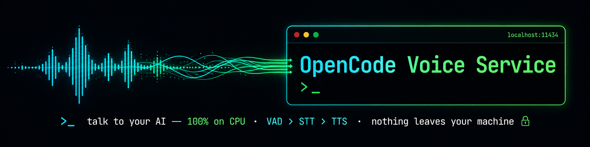

<p align="center">
  
</p>

<h1 align="center">Local VoiceMode LLM</h1>

<p align="center">
  <strong>Give your AI agent a voice — and ears — that run entirely on your CPU.</strong>
</p>

<p align="center">
  <a href="#quick-start">Quick Start</a> ·
  <a href="#benchmarks">Benchmarks</a> ·
  <a href="#agent-integrations">Integrations</a> ·
  <a href="#configuration">Config</a>
</p>

-----

A complete, local voice pipeline for AI agents. One command installs everything: [Silero VAD](https://github.com/snakers4/silero-vad) for detecting when you speak, [Parakeet TDT 0.6B](https://github.com/groxaxo/parakeet-tdt-0.6b-v3-fastapi-openai) for transcription, and [Supertonic TTS 3](https://github.com/groxaxo/supertonic-express-3) for synthesis. No cloud, no API keys, no GPU required.

It drops a `talk` skill into **Claude Code**, **OpenCode CLI**, **OpenClaw**, **Hermes Agent**, and **Codex**, then installs and starts the speech backends for you. Pick your agent, run the installer, start talking.

## Why CPU-only?

Because you don’t need a GPU for great voice — and the one you have is busy.

Every engine here runs on ONNX, tuned for CPU inference on Intel, AMD, and Apple Silicon. No CUDA, no ROCm, no driver hell. It runs the same on a laptop, in WSL, inside Docker, or on a CI machine. On a typical multi-GPU rig, that means your VRAM stays fully committed to the LLM doing the actual thinking, while the voice layer hums along on cores you weren’t using anyway.

The numbers below are **measured, not estimated** — and reproducible.

|Engine                  |Runtime  |CPU latency                           |Footprint|
|------------------------|---------|--------------------------------------|---------|
|**Silero VAD**          |ONNX     |~0.1 ms/frame                         |~1.3 MB  |
|**Parakeet TDT 0.6B v3**|ONNX INT8|~280 ms short reply · 8–21× realtime  |~600 MB  |
|**Supertonic TTS 3**    |ONNX FP16|~1.7 s short reply · 1.6–2.8× realtime|~196 MB  |
|**Supertonic TTS 2** _(optional)_|ONNX|~0.8 s short reply · 3.4–10.5× realtime|~252 MB  |

## Benchmarks

Measured on an **Intel Core i7-12700KF** (12C/20T desktop), CPU-only, median of 5 runs. Reproduce it against your own services:

```bash
python benchmarks/run_benchmark.py     # writes benchmarks/RESULTS.md
```

|Stage                            |Input           |Latency    |vs. realtime|
|---------------------------------|----------------|-----------|------------|
|**Silero VAD**                   |32 ms frame     |**0.09 ms**|~347×       |
|**Parakeet STT**                 |2.4 s utterance |**307 ms** |7.9×        |
|**Parakeet STT**                 |6.6 s utterance |**441 ms** |14.9×       |
|**Parakeet STT**                 |13.4 s utterance|**729 ms** |18.4×       |
|**Supertonic** · normal (8 steps)|→ 2.4 s audio   |**1.39 s** |1.7×        |
|**Supertonic** · normal (8 steps)|→ 13.4 s audio  |**5.18 s** |2.6×        |
|**Supertonic** · high (20 steps) |→ 2.4 s audio   |**2.46 s** |~1×         |
|**Supertonic** · high (20 steps) |→ 13.4 s audio  |**10.2 s** |1.3×        |

Supertonic defaults to **8 denoising steps** — short replies in ~1.4 s, faster than realtime. Set `TTS_QUALITY=high` for **20 steps** when quality matters more than speed. A TTS→STT round-trip transcribes back verbatim.

The voice overhead around your LLM is **~1.5–2 s** (STT + TTS combined). In practice, the slowest part of the loop is the LLM itself.

> Parakeet *can* use `onnxruntime-gpu` if you have spare VRAM — but the whole point is to leave the GPU for the model that’s answering you. The installer **auto-detects** your hardware: on a Linux box with an NVIDIA GPU it asks whether to use CUDA (and defaults to CPU if you decline or run non-interactively); Apple Silicon and CPU-only hosts stay on the ONNX-CPU path (this GPU toggle is Linux + NVIDIA only). Force it either way with `./setup.sh --gpu` or `./setup.sh --cpu`.

### Supertonic 2 — optional, even faster on CPU

[Supertonic 2](integrations/supertonic2/) is an optional backend (`bash integrations/supertonic2/install.sh`, then `TTS_ENGINE=supertonic2`). Measured **back-to-back on the same i7-12700KF, both CPU-only** (median of 5, voice F4), it synthesizes **~3.2× faster** than Supertonic 3 at the default 8 steps:

|Reply            |Audio  |Supertonic 3 (8 steps)|Supertonic 2 (8 steps)|Speed-up|
|-----------------|-------|----------------------|----------------------|--------|
|short (10 words) |2.4 s  |1.98 s · 0.82 RTF     |**0.78 s · 0.29 RTF** |2.6×    |
|medium (22 words)|6.6 s  |3.12 s · 0.48 RTF     |**0.99 s · 0.15 RTF** |3.2×    |
|long (45 words)  |13.4 s |5.44 s · 0.41 RTF     |**1.44 s · 0.10 RTF** |3.8×    |

At high quality (20 steps) the gap widens to **~3.4×** (mean RTF 0.31 vs 1.07). Both engines share the same OpenAI-compatible API and voices (F1–F5 / M1–M5), so switching is just `TTS_ENGINE`; Supertonic 2 runs on `:8880` and coexists with Supertonic 3 (`:8766`), falling back to it automatically. Full numbers and the reproduce script: [`benchmarks/TTS_BACKENDS.md`](benchmarks/TTS_BACKENDS.md) · `python benchmarks/compare_tts_backends.py`.

### Apple Silicon (Apple M5)

Measured on a MacBook Air (**Apple M5**), median of 3 runs. On Apple Silicon, TTS can run on the **Neural Engine** (`CPU_AND_NE`) while **ONNX Parakeet** handles STT.

|Stage                              |Input            |Latency    |vs. realtime|
|-----------------------------------|-----------------|-----------|------------|
|**Parakeet STT** · ONNX (CPU)      |2.4 s utterance  |**0.26 s** |9×          |
|**Parakeet STT** · ONNX (CPU)      |14.0 s utterance |**0.54 s** |26×         |
|**Parakeet STT** · CoreML (ANE)    |2.4 s utterance  |**0.075 s**|33×         |
|**Parakeet STT** · CoreML (ANE)    |14.0 s utterance |**1.23 s** |11×         |
|**Supertonic 3** · CoreML (ANE)    |→ 1.2 s audio    |**0.16 s** |~7×         |
|**Supertonic 3** · CoreML (ANE)    |→ 3.5 s audio    |**0.21 s** |16.6×       |

On the Neural Engine, Supertonic 3 TTS synthesizes **8–30× faster than CPU ONNX**. For STT, ONNX Parakeet is *faster than the CoreML recognizer on longer audio* (0.54 s vs 1.23 s) and is identical across macOS/Linux/Windows — so it stays the default everywhere; the CoreML recognizer only edges ahead on very short clips (~0.075 s vs ~0.26 s), a gap well below conversational perception.

## Architecture

```
  Mic ──▶ Silero VAD ──▶ WAV ──▶ Parakeet STT (:5093, ONNX, CPU)
    (local ONNX)                          │
                                          ▼
                                  Agent / OpenCode / Claude Code
                                          │
                                          ▼
                     ┌──────────────────────────────────────┐
                     │ Supertonic TTS (:8766) — default     │  ONNX, CPU
                     │ Supertonic 2  (:8880)  — optional    │  ONNX, CPU
                     │ Qwen3-TTS (:1888x)     — optional    │  local MLX
                     │ NeuTTS (:8020)         — fallback 1   │  local GGUF
                     │ Inworld (cloud)        — optional    │  cloud API
                     │ xAI (api.x.ai)         — fallback 2   │  cloud API
                     └──────────────────────────────────────┘
                                          │
                                          ▼
                                  playback ──▶ listen again

  Browser ──▶ Dashboard (:7862) ──▶ Supertonic :8766  (TTS test)
                (frontend/)      ──▶ Parakeet   :5093  (STT test)
                                 ──▶ systemctl         (GPU/CPU toggle)
```

> **Ports:** Supertonic uses `:8766` (not `:8765`) so it can coexist with an existing Chatterbox server — override with `SUPERTONIC_PORT=8765` to replace it. Parakeet STT runs on `:5093`; if a precompiled `speech-server` is already there, `setup.sh` detects it and leaves it alone.

## Features

- **Three CPU-native engines** — Silero VAD, Parakeet STT (25 languages), Supertonic TTS (EN/ES/KO/PT/FR)
- **Multi-engine TTS with fallbacks** — Supertonic (local ONNX, default) → NeuTTS (local GGUF) → xAI (cloud, last resort); local engines are always tried before the cloud. Optional opt-in engines: [**Qwen3-TTS**](https://github.com/groxaxo/Qwen3-TTS-Openai-Fastapi) (local MLX, Apple Silicon) and **Inworld** (cloud) — select with `TTS_ENGINE=<name>`
- **Click-free phrase edges** — every TTS clip/chunk gets a short fade-in/out (`TTS_FADE_MS`, default 6 ms), killing the onset/offset pop that neural engines (e.g. Inworld) emit at sentence boundaries
- **Pipelined talk loop** — TTS finishes, mic opens instantly (`TALK_AUTO_LISTEN=1`)
- **Barge-in** — interrupt playback by speaking (opt-in, `TALK_BARGE_IN=1`)
- **Five agents, one skill** — Claude Code, OpenCode CLI, OpenClaw, Hermes, Codex
- **Web dashboard** — test and tune every setting live at `:7862`, no npm, no build step
- **Cross-platform** — macOS, Linux, Windows
- **Non-destructive installs** — existing services are preserved; re-running `setup.sh` is safe

## Platform support

|Platform   |Installer  |Auto-start    |Audio                        |
|-----------|-----------|--------------|-----------------------------|
|**macOS**  |`setup.sh` |launchd       |`afplay`                     |
|**Linux**  |`setup.sh` |systemd (user)|`ffplay` / `aplay` / `paplay`|
|**Windows**|`setup.ps1`|Task Scheduler|`ffplay` / SoundPlayer       |

## Quick Start

### macOS / Linux

```bash
git clone https://github.com/groxaxo/opencode-voice-service.git
cd opencode-voice-service
chmod +x setup.sh && ./setup.sh
```

Run with no arguments for an **interactive menu** — choose which components (Parakeet, Supertonic) and which agents (Claude Code, OpenCode, OpenClaw, Hermes, Codex) to install. Or go straight through:

```bash
./setup.sh                                       # full install, all components + agents
./setup.sh --skip-parakeet                       # skip Parakeet STT
./setup.sh --skip-supertonic                     # skip Supertonic TTS
./setup.sh --integrations=claudecode,opencode    # only these agents

# Optional: cloud TTS fallback
export XAI_API_KEY=xai-...
```

Backends are installed and running when it finishes. That’s the whole setup.

### Windows (PowerShell)

```powershell
git clone https://github.com/groxaxo/opencode-voice-service.git
cd opencode-voice-service
.\setup.ps1
```

Same component/agent prompts, then registers Task Scheduler tasks that start Parakeet and Supertonic on login.

**Prerequisites:** Python 3.11+ (`winget install Python.Python.3.12`), Git (`winget install Git.Git`), and optionally ffmpeg for playback (`winget install Gyan.FFmpeg`).

### What gets installed

|Component              |Location                            |Port    |Auto-start                        |
|-----------------------|------------------------------------|--------|----------------------------------|
|Voice venv (VAD + ONNX)|`~/.config/opencode/tts-venv/`      |—       |—                                 |
|**Parakeet STT**       |`~/.config/opencode/parakeet-stt/`  |**5093**|launchd / systemd / Task Scheduler|
|**Supertonic TTS**     |`~/.config/opencode/supertonic-tts/`|**8766**|launchd / systemd / Task Scheduler|
|Supertonic 2 *(opt-in)*|`~/.config/opencode/supertonic2-tts/`|**8880**|`integrations/supertonic2/install.sh`|
|**Web dashboard**      |`frontend/` (repo)                  |**7862**|manual (`bash frontend/start.sh`) |
|`talk` skill           |per-agent (see below)               |—       |—                                 |

> **Optional: Supertonic 2.** [Supertonic Express 2](https://github.com/groxaxo/supertonic-express) (model `onnx-community/Supertonic-TTS-2-ONNX`) is a 66M-param, CPU-only, multilingual ONNX TTS with the same OpenAI-compatible API. Add it with `bash integrations/supertonic2/install.sh`, then select it with `TTS_ENGINE=supertonic2` — it runs on `:8880` alongside Supertonic 3 and falls back to it automatically. See [`integrations/supertonic2/`](integrations/supertonic2/README.md).

## Agent integrations

The installer copies the `talk` skill into each selected agent’s skill directory. Same `SKILL.md` descriptor everywhere — it tells the agent when to invoke voice (*talk, voice, speak, habla, audio, tts*), how to run the VAD → STT → TTS loop, and where the services live.

|Agent           |Skill path                       |Activation                      |
|----------------|---------------------------------|--------------------------------|
|**Claude Code** |`~/.claude/skills/talk/`         |`skill("talk")` or auto-detected|
|**OpenCode CLI**|`~/.config/opencode/skills/talk/`|`skill("talk")`                 |
|**OpenClaw**    |`~/.openclaw/skills/talk/`       |`skill("talk")`                 |
|**Hermes Agent**|`~/.hermes/skills/talk/`         |`skill("talk")`                 |
|**Codex**       |`~/.codex/skills/talk/`          |auto-detected via symlink       |

**More installer options:**

```bash
./setup.sh --venv-only          # only create the voice venv
./setup.sh --skip-voices        # skip reference voice generation
./setup.sh --no-integrations    # skip all agent integrations
./setup.sh --force              # overwrite existing plists/tasks (destructive)
./setup.sh --uninstall          # stop services, remove plists
./setup.sh --uninstall --force  # also remove installed dirs
```

## Talk to a local LLM (Ollama)

Point the voice loop at a model running in your local **[Ollama](https://github.com/ollama/ollama)** — speak to it, hear it reply, entirely offline. If Ollama is already installed, one command wires it up (**no Ollama rebuild**):

```bash
bash integrations/ollama/install.sh     # installs the `ollama-voice` command + voice backends
ollama-voice                            # talk to your default model — speak after the tone, Ctrl-C to exit
ollama-voice llama3.2 --text            # choose a model; type instead of speaking (mic-free test)
```

`ollama-voice` drives the **listen → chat → speak** loop against Ollama's HTTP API (the same one `ollama run` uses), reusing this project's CPU STT/TTS — so any model you can `ollama run`, you can talk to. See [`integrations/ollama/`](integrations/ollama/) for configuration and a native `ollama voice` subcommand (build-from-source) alternative.

## Web Dashboard

A single-page control panel for testing and tuning all three components live. No npm, no framework — open it in a browser.

```bash
cd frontend && bash start.sh
# → http://localhost:7862
```

|Panel               |Controls                                                                                       |
|--------------------|-----------------------------------------------------------------------------------------------|
|**TTS Test**        |Voice (F1–F5 / M1–M5), language, inference steps (1–20), speed (0.5–2×) → plays in-browser     |
|**STT Test**        |Record from mic or upload a WAV → transcribes via Parakeet                                     |
|**VAD Settings**    |Threshold, min silence, pre-speech padding, max duration → saved to `frontend-config.json`     |
|**Backend Settings**|GPU/CPU toggle per service → writes a systemd drop-in, restarts immediately, live status badges|

A FastAPI proxy on `:7862` forwards requests to Supertonic and Parakeet so you don’t hit CORS. Dependencies install into the existing `tts-venv` on first launch.

## Usage

### CLI

```bash
talk.sh listen                          # record + transcribe → stdout
talk.sh speak "Hello"                   # synthesize, then auto-listen
TTS_ENGINE=xai talk.sh speak "…"        # force xAI cloud TTS
TTS_ENGINE=supertonic talk.sh speak "…" # force local Supertonic
talk.sh status                          # health check
talk.sh devices                         # list mics + show selected
talk.sh pick                            # interactive mic picker (saves your choice)
talk.sh list-mics                       # machine-parseable device list
```

Run `talk.sh pick` once to choose your microphone — it lists every input device by number, you pick one, and that choice is saved to `~/.config/opencode/talk-mic.env` and reused on every future session. To switch later, just run `talk.sh pick` again or delete the config file.

(Skill lives at `~/.config/opencode/skills/talk/`. On Windows, use `talk.ps1` with the same verbs.)

### Agent talk loop

The agent runs:

1. **Once:** `talk.sh listen` → first user message
1. **Each turn:** `talk.sh speak '<reply>'` → plays audio, then records; **stdout is the next user message**
1. Never call `listen` after `speak` — it’s built in.

Full rules in [`skill/SKILL.md`](skill/SKILL.md).

## Configuration

|Variable             |Default                                        |Description                                                           |
|---------------------|-----------------------------------------------|----------------------------------------------------------------------|
|`STT_ENGINE`         |`local`                                        |STT backend — Parakeet on `:5093` (ONNX/CPU on Linux, CoreML on macOS)|
|`STT_URL`            |`http://127.0.0.1:5093/v1/audio/transcriptions`|Local Parakeet endpoint                                               |
|`TTS_ENGINE`         |`supertonic`                                   |`supertonic` (local ONNX) → `neutts` (local GGUF) → `xai` (cloud, last resort)     |
|`SUPERTONIC_URL`     |`http://127.0.0.1:8766`                        |Supertonic endpoint                                                   |
|`SUPERTONIC_VOICE`   |`F4`                                           |`F1`–`F5` / `M1`–`M5`                                                 |
|`TTS_QUALITY`        |`normal`                                       |`normal` = 8 steps (fast) · `high` = 20 steps (best)                  |
|`SUPERTONIC_STEPS`   |(from quality)                                 |Denoising steps `1`–`20`; overrides the preset                        |
|`XAI_API_KEY`        |(env)                                          |Bearer token for xAI cloud fallback                                   |
|`XAI_TTS_VOICE`      |`eve`                                          |`ara` · `eve` · `leo` · `rex` · `sal`                                 |
|`TALK_AUTO_LISTEN`   |`1`                                            |Run `listen` after `speak`                                            |
|`TALK_BARGE_IN`      |`0`                                            |Interrupt TTS on speech                                               |
|`TALK_IDLE_TIMEOUT_S`|`300`                                          |Session-silence window — end listen after N s of no speech (`0` = off)|
|`VAD_THRESHOLD`      |`0.5`                                          |Speech sensitivity — lower = catches softer speech, higher = ignores background noise/speech (also in dashboard)|
|`VAD_MIN_SILENCE_MS` |`700`                                          |End-of-turn silence — 700 ms tolerates mid-sentence pauses; lower (~500) for snappier turns (also in dashboard)|
|`MIC_QUERY`          |_(empty)_                                      |Mic name substring; empty = auto-detect (Linux prefers USB/Bluetooth mics over internal chipsets; macOS honors the OS system-default input; both skip virtual adapters). Run `talk.sh pick` to choose interactively — saved to `~/.config/opencode/talk-mic.env` and reused across sessions|
|`PORT`               |`7862`                                         |Dashboard port                                                        |

### Tuning the mic for your room

Silero VAD listens through **one microphone with no speaker separation** — it captures
whatever crosses the speech threshold, including a TV, music, or other people talking
nearby. In a quiet one-on-one setting it's accurate out of the box; in a noisy room you
may need to tune two knobs:

| Symptom | Fix |
|---------|-----|
| Picks up background speech / TV / other people | Raise `VAD_THRESHOLD` toward `0.6`–`0.7` (stricter — only clearer, louder speech triggers) |
| Misses your speech / clips soft talkers | Lower `VAD_THRESHOLD` toward `0.3`–`0.4` (more sensitive) |
| Cuts you off during a natural pause | Raise `VAD_MIN_SILENCE_MS` (e.g. `900`) so longer pauses don't end the turn |
| Feels sluggish to respond after you stop | Lower `VAD_MIN_SILENCE_MS` toward `500` for snappier endpointing |
| Grabs the wrong microphone | Run `talk.sh pick` to choose interactively (saved for next time); or set `MIC_QUERY` to a substring of your mic's name (e.g. `MIC_QUERY="Headset"`); see `talk.sh devices` |

```bash
# Example: noisy room, want it to only react to clear, deliberate speech
VAD_THRESHOLD=0.65 VAD_MIN_SILENCE_MS=800 talk.sh listen
```

All values are also adjustable live in the [Web Dashboard](#web-dashboard) (saved to `frontend-config.json`).

## Service management

<details>
<summary><strong>macOS (launchd)</strong></summary>

```bash
launchctl kickstart -k gui/$UID/com.opencode.parakeet-stt   # restart
launchctl bootout      gui/$UID/com.opencode.parakeet-stt   # stop
launchctl kickstart -k gui/$UID/com.opencode.supertonic
launchctl bootout      gui/$UID/com.opencode.supertonic

tail -f ~/.config/opencode/parakeet-stt.log
tail -f ~/.config/opencode/supertonic.log
```

</details>

<details>
<summary><strong>Linux (systemd)</strong></summary>

```bash
systemctl --user start  opencode-parakeet-stt
systemctl --user status opencode-parakeet-stt
journalctl --user -u    opencode-parakeet-stt -f

systemctl --user start  opencode-supertonic
systemctl --user status opencode-supertonic
journalctl --user -u    opencode-supertonic -f
```

</details>

<details>
<summary><strong>Windows (Task Scheduler)</strong></summary>

```powershell
Start-ScheduledTask "OpenCode-Parakeet-STT"
Stop-ScheduledTask  "OpenCode-Parakeet-STT"
Start-ScheduledTask "OpenCode-Supertonic"
Stop-ScheduledTask  "OpenCode-Supertonic"

Get-Content "$env:USERPROFILE\.config\opencode\parakeet-stt.log" -Tail 50
Get-Content "$env:USERPROFILE\.config\opencode\supertonic.log"   -Tail 50
```

</details>

## Project layout

```
opencode-voice-service/
├── setup.sh / setup.ps1     # installers (macOS+Linux / Windows)
├── service/
│   ├── vad_recorder.py      # Silero VAD + sounddevice
│   ├── talk.sh              # voice conversation orchestrator
│   ├── tts.sh               # multi-engine TTS CLI
│   └── tts_lang.sh          # language detection
├── windows/talk.ps1         # Windows orchestrator
├── skill/SKILL.md           # agent skill descriptor
├── launchd/                 # macOS auto-start plists
├── frontend/                # web dashboard
├── integrations/ollama/     # talk to a local Ollama model by voice (autoinstaller + command)
└── benchmarks/              # reproducible benchmark suite
```

## Related projects

- [parakeet-tdt-0.6b-v3-fastapi-openai](https://github.com/groxaxo/parakeet-tdt-0.6b-v3-fastapi-openai) — STT backend
- [supertonic-express-3](https://github.com/groxaxo/supertonic-express-3) — Supertonic 3 TTS runtime
- [supertonic-3-v2](https://github.com/groxaxo/supertonic-3-v2) — Supertonic 3 FP16 ONNX model
- [OpenVoiceApp](https://github.com/groxaxo/OpenVoiceApp) — iOS voice app
- [OpenCode](https://opencode.ai)

## License

MIT
