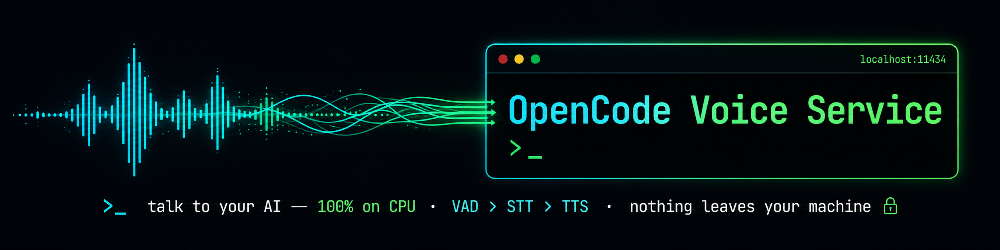

<p align="center">
  
</p>

<h1 align="center">Local VoiceMode LLM</h1>

<p align="center">
  <strong>Fast, local-first voice conversations for coding agents and local LLMs—without consuming the model's VRAM.</strong>
</p>

<p align="center">
  
  
  
  
  
</p>

Local VoiceMode LLM is a cross-platform speech layer for Claude Code, OpenCode, OpenClaw, Hermes Agent, Codex, Ollama, and other local agents. The default path keeps microphone endpointing, transcription, and synthesis on the host.

| Stage | Default backend | Port | Compute |
|---|---|---:|---|
| Voice activity detection | Silero VAD | — | CPU |
| Speech-to-text | Parakeet TDT 0.6B v3, ONNX | `5093` | CPU by default |
| Text-to-speech | Supertonic 3, ONNX/MLX | `8766` | CPU or Apple Silicon |
| Dashboard | FastAPI + static HTML | `7862` | CPU |

Your accelerator remains available for Ollama, vLLM, SGLang, MLX, or another model server.

## xAI never receives an untagged sentence

Every xAI request made by the Unix runtime must prove that every segmented sentence has at least one valid xAI speech tag:

```json
{
  "sentence_count": 2,
  "tagged_sentence_count": 2,
  "untagged_sentence_indexes": []
}
```

This is a hard pre-provider safety gate:

1. Segment every sentence.
2. Use an optional OpenAI-compatible local model for contextual direction.
3. Validate each returned row independently.
4. Deterministically repair every missing, malformed, unknown-tag, unbalanced, or source-rewriting row.
5. Verify an explicit N/N proof.
6. Only then build the xAI request.

The same rule protects direct `TTS_ENGINE=xai`, xAI reached after another backend fails, and the optional AI Sentence Tagger / AI Voice Studio bridge. If the proof is incomplete, xAI is not contacted.

```text
Input:  Hello. Are you there?
Output: <emphasis>Hello.</emphasis> <higher-pitch>Are you there?</higher-pitch>
```

See [Mandatory xAI sentence tagging](docs/xai-sentence-tagging.md).

## Highlights

- Real VAD-driven microphone turns—no simulated transcript or fake playback.
- Local Parakeet transcription through an OpenAI-compatible endpoint.
- Local Supertonic speech by default, with optional Qwen3-TTS, NeuTTS, Inflect, Inworld, OpenAI-compatible, xAI, and IndexTTS paths.
- Automatic listen-after-speak, stop phrases, idle termination, device selection, and optional barge-in.
- Shared agent skill for Claude Code, OpenCode, OpenClaw, Hermes, and Codex.
- Optional Ollama conversation loop and browser dashboard.
- Optional AI Sentence Tagger / AI Voice Studio bridge for the verified 26-voice xAI and 30-voice Gemini catalogs.
- Public native installation, authenticated private-fork installation, private/local operation, hosted hybrid operation, and Docker deployment.
- Deterministic local validation; GitHub Actions are not required as a release gate.

## Installation modes

### Public repository: macOS or Linux

```bash
git clone https://github.com/groxaxo/Local-VoiceMode-LLM.git
cd Local-VoiceMode-LLM
chmod +x setup.sh
./setup.sh
```

Non-interactive CPU installation:

```bash
./setup.sh --cpu
```

### Private fork or internal mirror

GitHub CLI:

```bash
gh auth login
gh repo clone OWNER/PRIVATE-VOICE-REPO
cd PRIVATE-VOICE-REPO
./setup.sh
```

SSH:

```bash
git clone git@github.com:OWNER/PRIVATE-VOICE-REPO.git
cd PRIVATE-VOICE-REPO
./setup.sh
```

Do not put a GitHub token in clone URLs, scripts, Dockerfiles, image labels, or build arguments.

### Windows PowerShell

```powershell
git clone https://github.com/groxaxo/Local-VoiceMode-LLM.git
cd Local-VoiceMode-LLM
.\setup.ps1
```

Recommended prerequisites:

```powershell
winget install --id Git.Git
winget install --id Python.Python.3.12
winget install --id Microsoft.VCRedist.2015+.x64
winget install --id Gyan.FFmpeg
```

Graphical selector and service manager:

```powershell
.\windows\VoiceModeManager.ps1
```

See [Windows setup](docs/windows.md).

## Docker

The repository includes two container targets.

### Cross-platform dashboard

```bash
docker compose up -d --build dashboard
```

Open `http://127.0.0.1:7862`.

The dashboard container is small and connects to host or network Parakeet/Supertonic endpoints. It does not need microphone access. Defaults:

```text
Supertonic -> http://host.docker.internal:8766
Parakeet   -> http://host.docker.internal:5093
```

Override with `DOCKER_SUPERTONIC_URL` and `DOCKER_PARAKEET_URL`.

### Linux host-audio container

```bash
cp .env.example .env
export APP_UID="$(id -u)"
export APP_GID="$(id -g)"
export AUDIO_GID="$(getent group audio | cut -d: -f3)"

docker compose \
  -f docker-compose.yml \
  -f docker-compose.audio.yml \
  --profile audio \
  up -d --build audio
```

Inspect devices:

```bash
docker compose \
  -f docker-compose.yml \
  -f docker-compose.audio.yml \
  exec audio bash /app/service/talk.sh devices
```

The audio target includes CPU PyTorch, Silero VAD, ONNX Runtime, PortAudio, ALSA/Pulse utilities, ffmpeg, and the same mandatory xAI sentence safety wrapper as native Unix.

Native installation remains recommended for macOS and Windows microphone/audio because Docker Desktop does not expose CoreAudio or Windows audio like a native process.

The supplied Compose stack binds the dashboard to loopback, runs non-root, drops capabilities, enables `no-new-privileges`, uses a read-only root filesystem, and keeps configuration in a named volume.

Full private/public source builds, BuildKit SSH and token secrets, Linux audio, PipeWire/Pulse overrides, privacy modes, provider bridges, public exposure, and validation are covered in [Docker deployment](docs/DOCKER.md).

## Private/local versus hybrid operation

### Fully private/local

```text
microphone -> Silero VAD -> local Parakeet -> local agent/LLM
           -> local Supertonic/Qwen/NeuTTS -> playback
```

Recommended baseline:

```bash
export STT_ENGINE=local
export STT_URL=http://127.0.0.1:5093/v1/audio/transcriptions
export STT_MODEL=parakeet-tdt-0.6b-v3
export TTS_ENGINE=supertonic
export SUPERTONIC_URL=http://127.0.0.1:8766
export TTS_QUALITY=normal
```

Do not configure cloud provider keys in this mode.

### Hybrid or non-private provider path

Remote STT sends recorded audio to the chosen endpoint. Remote TTS sends reply text to the chosen endpoint. The xAI/Google companion bridge sends directed text to the provider configured by the companion service.

Choose this mode when provider-specific voices or offload matter more than keeping all speech data local.

## Quick verification

After native setup:

```bash
~/.config/opencode/skills/talk/talk.sh status
~/.config/opencode/skills/talk/talk.sh devices
~/.config/opencode/skills/talk/talk.sh listen
```

One-way notification:

```bash
TALK_AUTO_LISTEN=0 \
~/.config/opencode/skills/talk/talk.sh speak \
  'The build completed successfully.'
```

## Conversation protocol

Initial turn:

```bash
transcript="$(talk.sh listen)"
```

Subsequent turns:

```bash
transcript="$(talk.sh speak 'Assistant reply')"
```

With `TALK_AUTO_LISTEN=1`, `speak` synthesizes and plays the reply, emits the ready cue, records the next turn, transcribes it, and prints the next transcript to stdout. Empty stdout is the clean session-end signal.

Do not call `listen` again after `speak`; that opens a duplicate recording cycle.

## Supported agents

| Agent | Installed skill path |
|---|---|
| Claude Code | `~/.claude/skills/talk/` |
| OpenCode CLI | `~/.config/opencode/skills/talk/` |
| OpenClaw | `~/.openclaw/skills/talk/` |
| Hermes Agent | `~/.hermes/skills/talk/` |
| Codex | `~/.codex/skills/talk/` |

The canonical agent contract is [`skill/SKILL.md`](skill/SKILL.md).

## TTS choices

| Path | Location | Selection |
|---|---|---|
| Supertonic 3 | local ONNX/MLX | `TTS_ENGINE=supertonic` |
| Supertonic 2 | local ONNX, `:8880` | `TTS_ENGINE=supertonic` plus alternate URL |
| Qwen3-TTS | local MLX service | `TTS_ENGINE=qwen` or `qwen-lazy` |
| NeuTTS | local GGUF service | `TTS_ENGINE=neutts` |
| Inflect Nano | local, English only | `TTS_ENGINE=inflect` |
| OpenAI-compatible TTS | LAN or hosted | `TTS_ENGINE=openai` |
| Inworld | hosted | `TTS_ENGINE=inworld` |
| Direct xAI | hosted, sentence-tagged | `TTS_ENGINE=xai` |
| IndexTTS | Windows CUDA service | `TTS_ENGINE=indextts` in `talk.ps1` |
| AI Sentence Tagger / Voice Studio | local companion; xAI or Google synthesis | override `TTS_SH` |

Exact Unix fallback order, credentials, and provider limits are in [Providers](docs/providers.md).

## Verified xAI and Google voices

The optional companion bridge reuses AI Sentence Tagger or AI Voice Studio instead of duplicating provider catalogs in shell code.

| Provider | Built-in voices | Default | Direction semantics | VoiceMode output |
|---|---:|---|---|---|
| xAI | 26 | `eve` | fixed 14 inline + 13 wrapping tags | WAV 48 kHz |
| Google Gemini | 30 | `Kore` | 16 common examples plus creative English direction | WAV 24 kHz |

Install the bridge natively:

```bash
bash integrations/ai-sentence-tagger/install.sh
```

Use Google:

```bash
export TTS_SH="$HOME/.config/opencode/ai-tts-provider/tts-provider.sh"
export AI_TTS_URL=http://127.0.0.1:8000
export AI_TTS_PROVIDER=google
export AI_TTS_VOICE=Kore

talk.sh speak 'The deployment completed.'
```

The bridge requests complete annotations and refuses audio unless every sentence is independently proven tagged.

See [AI provider bridge](integrations/ai-sentence-tagger/README.md).

## Runtime architecture

```text
Microphone
   │
   ▼
Silero VAD ──► PCM WAV ──► Parakeet STT :5093
                                  │
                                  ▼
                         Agent / local LLM
                                  │
                                  ▼
                   talk.sh / talk.ps1 orchestrator
                         │                 │
                         ▼                 ▼
                service/tts.sh       optional TTS_SH bridge
                safety wrapper              │
                  │       │                  │
                  ▼       ▼                  │
          local/remote   tagged xAI          │
            backends                          │
                  └──────────────┬────────────┘
                                 ▼
                              playback
                                 │
                                 ▼
                            next user turn
```

Detailed recorder coordinates, pre-warmed microphone behavior, barge-in, service boundaries, and platform differences are in [Architecture](docs/architecture.md).

## Configuration

Scripts read the environment of the launching process. They do not automatically source `.env.example`.

Important variables:

| Variable | Purpose |
|---|---|
| `STT_ENGINE` | Unix STT route: `local` or `remote` |
| `STT_URL` / `STT_MODEL` | Local transcription endpoint and model |
| `TTS_ENGINE` | Primary backend selection through the safety wrapper |
| `TTS_SH` | Unix implementation override for the companion bridge |
| `TTS_TAG_MODE` | xAI tag mode: `auto`, `llm`, or `deterministic` |
| `TTS_TAGGER_URL` / `TTS_TAGGER_MODEL` | Optional OpenAI-compatible direction model |
| `SUPERTONIC_URL` / `SUPERTONIC_VOICE` | Local TTS endpoint and voice |
| `VAD_THRESHOLD` | Speech sensitivity |
| `VAD_MIN_SILENCE_MS` | Silence required to close a turn |
| `MIC_QUERY` | Input-device name substring |
| `TALK_AUTO_LISTEN` | Reopen the microphone after playback |
| `TALK_BARGE_IN` | Interrupt playback when speech is detected |
| `TALK_STOP_PHRASES` | Pipe-separated spoken session-stop phrases |

Start from [`.env.example`](.env.example).

## Validation

```bash
python -m compileall -q service frontend tests integrations
python -m pytest -q
bash -n service/talk.sh service/tts.sh service/tts_backends.sh
bash -n integrations/ai-sentence-tagger/tts-provider.sh
docker compose config
docker compose -f docker-compose.yml -f docker-compose.audio.yml --profile audio config
```

Deterministic tests inspect the exact outbound xAI payload and verify one valid, source-preserving tag per sentence before the fake provider is called.

Physical microphone, speaker, model downloads, service managers, and paid-provider requests remain host-specific smoke tests.

## Documentation

| Guide | Contents |
|---|---|
| [Documentation index](docs/README.md) | complete guide map |
| [Installation](docs/installation.md) | native setup, services, upgrades, uninstall |
| [Docker deployment](docs/DOCKER.md) | dashboard/audio images, private/public builds, privacy and exposure |
| [Mandatory xAI tagging](docs/xai-sentence-tagging.md) | N/N invariant and local LLM direction |
| [Windows](docs/windows.md) | PowerShell orchestrator and manager |
| [Architecture](docs/architecture.md) | runtime design and data flow |
| [Providers](docs/providers.md) | engines, credentials, bridge, and fallback policy |
| [Troubleshooting](docs/troubleshooting.md) | diagnosis and recovery |
| [Benchmarks](benchmarks/README.md) | reproducible latency tests |

## Operational boundaries

- The default VAD/STT/TTS path stays local.
- Hosted providers receive audio or reply text according to the selected route.
- Barge-in is acoustic detection, not echo cancellation; prefer headphones when speakers bleed into the microphone.
- Windows and Unix orchestrators are separate implementations.
- Strict direct-xAI and companion-bridge enforcement is wired into Unix/macOS paths.
- Docker dashboard mode is cross-platform; direct container audio is Linux-only.
- Never commit API credentials or include them in prompts, logs, images, or issue reports.

## License

MIT
